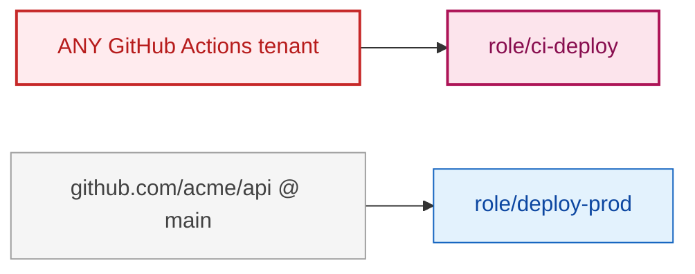

<h1 align="center">frontdoor</h1>

<p align="center">
  <strong>Map the federated trust <em>into</em> your cloud accounts.</strong><br/>
  Who outside can get in, and how far they get once they are in.
</p>

<p align="center">
  <a href="https://github.com/secorvia/frontdoor/releases/latest"></a>
  <a href="https://github.com/secorvia/frontdoor/actions/workflows/ci.yml"></a>
  <a href="https://goreportcard.com/report/github.com/secorvia/frontdoor"></a>
  <a href="LICENSE"></a>
  
  
</p>

<p align="center">
  <a href="#30-seconds">Install</a> ·
  <a href="#what-it-finds">Rules</a> ·
  <a href="#how-this-compares">Compared to other tools</a> ·
  <a href="#safety">Safety</a> ·
  <a href="https://www.secorvia.com/docs/frontdoor/">Docs</a>
</p>

---

Every cloud security scanner looks at what is *inside* an account. None of them
map the doors leading *in*: the OIDC, SAML and cross-account trusts that let a
GitHub repository, a CI pipeline, a SaaS vendor or another cloud obtain
credentials in your account.

They are easy to get wrong and nothing flags them when you do. A role that
trusts a GitHub repository looks identical in an inventory whether the trust is
pinned to one branch of one repo or left open to every repository on GitHub.
`frontdoor` reads the trust policy and tells you which one it is.

```
$ frontdoor scan

  frontdoor 0.1.0  ·  acme-prod (111122223333), acme-prod  ·  2026-09-25 09:12 UTC

  ▐ WHO CAN GET IN ────────────────────────────────────────────────────────────

    ANY GitHub Actions tenant              →  role/ci-deploy     privileged
    github.com/acme/api @ refs/heads/main  →  role/deploy-prod

  ▐ HOW FAR THEY GET ──────────────────────────────────────────────────────────

    github.com/acme/api @ refs/heads/main
      → role/deploy-prod          sts:AssumeRoleWithWebIdentity
        → [gcp] data-pipeline@acme-prod   BigQuery datasets
      One repo compromise reaches BigQuery datasets.

  ▐ CRITICAL  (1) ─────────────────────────────────────────────────────────────

    FD001  ANY GitHub Actions tenant can assume role/ci-deploy
           arn:aws:iam::111122223333:role/ci-deploy

           Wrong     The trust policy places no condition on
                     token.actions.githubusercontent.com:sub, so the subject
                     claim is never checked.
           Attacker  Anyone able to get a token from
                     token.actions.githubusercontent.com - which on a public CI
                     platform means anyone at all - can assume this role and
                     use everything it grants.
           Fix       Pin the subject claim to the exact identity you intend to
                     trust.

                     "Condition": {
                       "StringEquals": {
                         "token.actions.githubusercontent.com:aud": "sts.amazonaws.com",
                         "token.actions.githubusercontent.com:sub": "repo:acme/api:ref:refs/heads/main"
                       }
                     }

           Docs      https://www.secorvia.com/docs/frontdoor/FD001

  2 external identities can enter your clouds. 1 accepts ANY GitHub repository.
  One of them crosses AWS into GCP and reaches BigQuery datasets.
  3 findings: 2 critical, 1 high.
```

> **Status: feature complete.** AWS, GCP and Azure (beta), 15 rules, the full
> output layer, and cross-cloud chains.
>
> Requires **Go 1.26** to build. See the dependency note under Safety.

## 30 seconds

```bash
go install github.com/secorvia/frontdoor/cmd/frontdoor@latest
frontdoor scan
```

It uses whatever credentials you already have (`~/.aws`, `gcloud auth
application-default`, `az login`), reads nothing else, writes nothing anywhere,
and prints the report above. No config file, no account, no signup.


---

## What it finds

| ID | Severity | What it catches |
|---|---|---|
| **FD001** | critical¹ | No condition on the subject claim, so any tenant of that issuer can assume the role |
| **FD002** | critical to medium² | No condition on the audience claim |
| **FD003** | critical | An open door on a role that can escalate to account takeover |
| **FD005** | medium | Subject condition namespaced to the **wrong issuer**, so AWS never evaluates it |
| **FD010** | high | Org-wide subject (`repo:acme/*`), meaning any repository in the org |
| **FD011** | high | Repository pinned but **any branch or tag** can assume |
| **FD012** | high | The `pull_request` context is accepted (`pull_request_target` risk) |
| **FD013** | high³ | Cross-account trust with no `sts:ExternalId`, the confused deputy |
| **FD014** | high³ | Trust to an account that is neither yours nor a vendor we can identify |
| **FD015** | high | Trust rests on `repository_owner` alone, which is a name, not a stable id |
| **FD020** | medium | Long-lived access keys still active on an account that uses federation |
| **FD021** | medium | Unused identity provider, or an external trust never assumed |
| **FD022** | medium/low | OIDC thumbprint missing, or not matching the issuer's current cert (AWS only) |
| **FD030** | critical/high | **Chain.** A federated identity that reaches something privileged, or a data store, through one or more hops |
| **FD031** | critical/high | **Cross-cloud chain.** The path leaves the cloud it started in |

¹ **high** instead when the door is held by a real narrowing condition such as
`aws:PrincipalOrgID` or `sts:ExternalId`, and also for a SAML trust, which
admits every user of *your* IdP. That is too wide, but it is not the open
internet.

² Severity here is contextual rather than a flat "critical", which is a
deliberate departure. Missing `aud` **with no subject condition** means any
token that issuer ever minted is accepted, so that is critical. Missing `aud`
**with an exact subject** is a hardening gap, so medium. On GitHub the workflow
chooses its own `aud` anyway, so `aud` was never the barrier there; `sub` is.

³ **medium** when `organizations:ListAccounts` was denied. The tool cannot then
prove the account is a stranger, and the finding says so.

### FD030 and FD031 are the ones other tools miss

A chain inside one cloud, where every hop on its own looks unremarkable:

```
github.com/acme/api @ main  →  ci@acme-prod       (no privileges, looks fine)
                            →  build@acme-prod    (no privileges, looks fine)
                            →  deploy@acme-prod   ← roles/owner
```

A scanner that reports the first hop tells you the repository can become
`ci@`, which is true and useless. `frontdoor` follows the
`roles/iam.serviceAccountTokenCreator` edges to the end and reports the whole
path, the weakest link on it, and which binding to remove.

And the case nothing else reports at all: a chain that leaves the cloud it
started in.

```
  ▐ HOW FAR THEY GET ──────────────────────────────────────────

    github.com/acme/api @ refs/heads/main
      → role/ci-deploy          sts:AssumeRoleWithWebIdentity
        → [gcp] data-pipeline@acme-prod   BigQuery datasets
      One repo compromise reaches BigQuery datasets.
```

Your AWS scanner stops at `role/ci-deploy`. Your GCP scanner sees a workload
identity binding from "some AWS role" and has no idea a public CI platform is
on the other end of it. **Neither of them is wrong, and neither of them reports
this path.** `frontdoor` joins the two halves through the assumed-role ARN a
GCP AWS-provider records, or through the numeric service-account id an AWS
trust policy carries, and walks straight through the seam.

If only one cloud was scanned, no edge is drawn: an account we were never
pointed at is genuinely outside, and inventing a node we know nothing about
would be worse than stopping.

Chains are ranked by **entry looseness × terminal sensitivity**, never by
length. At equal weight a cross-cloud path ranks above a same-cloud one. A
two-hop chain from "any GitHub repository" into project owner beats a five-hop
chain from one pinned branch into a log bucket.

The terminal is classified by what it actually holds, not just whether it can
escalate: `roles/bigquery.dataViewer` is not a privilege escalation, and a
tool that only looks for escalation would call that chain harmless.

Every finding carries the rule id, severity, the exact resource ARN, one
sentence on what is wrong, one sentence on what an attacker could do, the policy
text it rests on as evidence, and a fix. The fix includes a corrected
`Condition` block built from the door's real issuer, org and repo.

```jsonc
"fix": {
  "summary": "Pin the subject claim to the exact identity you intend to trust.",
  "trust_policy": "\"Condition\": {\n  \"StringEquals\": {\n    \"token.actions.githubusercontent.com:aud\": \"sts.amazonaws.com\",\n    \"token.actions.githubusercontent.com:sub\": \"repo:YOUR_ORG/YOUR_REPO:ref:refs/heads/main\"\n  }\n}",
  "steps": ["Confirm which repository is supposed to use this role.", "..."]
}
```

---

## How this compares

The cloud security space is crowded and several of these tools are excellent.
`frontdoor` is not trying to replace them, and pretending otherwise would be an
easy claim to disprove.

| Tool | What it is best at | Where it stops |
|---|---|---|
| [**Prowler**](https://github.com/prowler-cloud/prowler) | 600+ checks across AWS, Azure, GCP, Kubernetes. The broadest coverage available. | Attack-path analysis needs Prowler App, which means Docker Compose plus Neo4j. Individual trust checks, no end-to-end path. |
| [**Cartography**](https://github.com/lyft/cartography) | Graphs AWS, GCP, Azure, GitHub and Okta into one model. Genuinely powerful. | Requires a Neo4j deployment and Cypher queries you write yourself. It is infrastructure, not a command. |
| [**PMapper**](https://github.com/nccgroup/PMapper) | IAM privilege-escalation paths within an account. | AWS only, inside one account. Federation into the account is out of scope. |
| [**github-oidc-checker**](https://github.com/rezonatelabs) | Exactly our FD001/FD002: GitHub OIDC `sub` and `aud` conditions. | GitHub only, AWS only, one check. |
| [**ScoutSuite**](https://github.com/nccgroup/ScoutSuite) | Multi-cloud configuration audit. | No commit since May 2024. |
| **frontdoor** | The doors *into* an account, and the path from an outside identity to what it finally reaches, including **across cloud boundaries**. One binary. | Not a general CSPM. No bucket ACLs, security groups, encryption or compliance frameworks. |

**Two things here are genuinely not available elsewhere in open source:**

1. **Cross-cloud trust paths (FD031).** The AWS-to-GCP workload-identity attack
   is well documented and widely written about. No open-source tool detects it,
   because detecting it requires joining two clouds' views of the same identity:
   the assumed-role ARN inside a GCP provider subject, or a service account's
   numeric unique id inside an AWS trust policy. `frontdoor` does that join.

2. **Path analysis with no infrastructure.** Every tool above that follows paths
   wants a graph database first. That is a reasonable design for a platform,
   and the wrong one for something you run once to answer a question.
   `frontdoor` is a single static binary with no daemon, database or config file.

If you already run Prowler, run this alongside it. It answers a question Prowler
does not ask.

---

## What it reads

| | |
|---|---|
| **OIDC providers** | issuer URL, registered audiences, thumbprints |
| **SAML providers** | entityID and validity. The metadata document is never stored |
| **Every IAM role trust policy** | parsed into structured doors, one per external principal |
| **Subject claims** | GitHub Actions, GitLab CI, CircleCI, Terraform Cloud, Vercel, Buildkite, Bitbucket Pipelines, Google (AWS↔GCP federation) |
| **GitHub immutable subjects** | `repo:org@123456/repo@456789:...`, the format repositories created after 15 July 2026 use. Read so the report shows plain names, with the numeric ids carried back into every suggested fix, because a condition written without them stops matching |
| **Cross-account trusts** | account id, `sts:ExternalId` presence, known-vendor labelling |
| **What each door grants** | attached + inline policies flattened, privilege-escalation actions flagged with a reason |
| **Organization layout** | so a sibling account is not reported as a stranger |
| **IAM user access keys** | age and last-used, because federation plus static keys means two front doors |

On **GCP**:

| | |
|---|---|
| **Workload identity pools and providers** | issuer, allowed audiences, `attributeMapping`, `attributeCondition` |
| **Service account IAM policies** | every `roles/iam.workloadIdentityUser` binding, joined to the provider behind its pool |
| **Impersonation edges** | `serviceAccountTokenCreator`, `serviceAccountUser`, `workloadIdentityUser` between service accounts |
| **Project IAM policy** | external principals bound directly, and which roles each service account holds |
| **User-managed SA keys** | creation date. GCP's name for the same mistake as a static access key |

A GCP "door" is not one object. A provider says which outside identities
*exist*; a service-account binding says which of them may *become* that
account. Neither half means anything on its own, so `frontdoor` always joins
them, and a binding naming `principalSet://.../workloadIdentityPools/POOL/*`
is the GCP spelling of "any repository on GitHub".

Three GCP behaviours are deliberately **not** copied from the AWS rules,
because a literal translation would flag correct configuration:

- An empty `allowedAudiences` is GCP's **secure default**: the audience
  becomes the provider's own canonical resource name, so FD002 does not fire
  on it. It fires on a *custom* audience that is not tied to this provider.
- GCP does not report last-used for service-account keys, so FD020 never says
  "never used" about one. It flags on age, and says the last use is not
  reported.
- Thumbprints do not exist on GCP providers, so FD022 does not apply at all.

### Why the subject claim matters

These two trust policies look the same in a console. They are not:

```jsonc
// Anyone with a GitHub account can assume this role.
"Condition": {
  "StringEquals": { "token.actions.githubusercontent.com:aud": "sts.amazonaws.com" }
}

// Only the main branch of one repository can.
"Condition": {
  "StringEquals": {
    "token.actions.githubusercontent.com:aud": "sts.amazonaws.com",
    "token.actions.githubusercontent.com:sub": "repo:acme/api:ref:refs/heads/main"
  }
}
```

`frontdoor` reports the first as `ANY GitHub Actions tenant` (FD001, critical)
and the second as `github.com/acme/api @ refs/heads/main` (no finding).

It also handles a third case most tools get wrong: a `sub` condition written
against a **different** issuer's namespace. AWS never puts that key in the
request context, so a plain `StringEquals` evaluates false and the role can be
assumed by **nobody**. That is a *broken* door, not an open one, reported as
FD005 (medium), never as a wide-open critical.

---

## Install

```bash
# Go toolchain (needs Go 1.26+)
go install github.com/secorvia/frontdoor/cmd/frontdoor@latest

# Homebrew
brew install secorvia/tap/frontdoor

# Script: verifies the SHA-256 against the signed checksums file before
# unpacking, and the cosign signature too if cosign is installed
curl -fsSL https://raw.githubusercontent.com/secorvia/frontdoor/main/install.sh | sh
```

Or build from source:

```bash
git clone https://github.com/secorvia/frontdoor
cd frontdoor
go build -o frontdoor ./cmd/frontdoor
```

### Verifying a release

Release archives are signed keyless through the GitHub Actions OIDC identity,
the same mechanism this tool audits, used the way it should be: the signature
is bound to the exact workflow and ref that produced the artifact.

```bash
cosign verify-blob checksums.txt \
  --certificate checksums.txt.pem \
  --signature checksums.txt.sig \
  --certificate-identity-regexp 'https://github\.com/secorvia/frontdoor/\.github/workflows/.+' \
  --certificate-oidc-issuer https://token.actions.githubusercontent.com

sha256sum -c checksums.txt --ignore-missing
```

If you would rather not pipe a script into a shell, which is a reasonable
position for a security tool, use `go install`, or take the archive from the
releases page and check it by hand.

---

## Use

```bash
# Scan the account your default credentials point at
frontdoor scan --aws

# Fail a CI job on anything high or worse
frontdoor scan --aws --fail-on high

# Collect only, no rules, then evaluate somewhere else
frontdoor scan --aws --no-rules --output doors.json
```

JSON goes to **stdout**, the summary to **stderr**, so piping is safe:

```bash
frontdoor scan --aws | jq '.findings[] | select(.severity=="critical")'
frontdoor scan --aws | jq -r '.findings[] | "\(.id) \(.resource_arn)"'
```

### Flags

| Flag | Meaning |
|---|---|
| `--aws` | scan AWS |
| `--gcp` | scan GCP with Application Default Credentials |
| `--gcp-project <ids>` | comma-separated project ids to scan |
| `--gcp-all-projects` | scan every project the caller can see (off by default; on a large org that is thousands of calls nobody asked for) |
| `--gcp-credentials <f>` | a service-account key file instead of ADC |
| `--azure` | recognised, not implemented yet; the CLI says so rather than scanning nothing |
| `--format <fmt>` | `terminal` (default), `json`, `sarif`, `mermaid` |
| `--color <when>` | `auto` (default), `always`, `never`. `NO_COLOR` always wins |
| `--profile <name>` | AWS shared-config profile |
| `--region <region>` | region used to sign requests (IAM itself is global) |
| `--vendors <file>` | extra account-id → vendor labels (see below) |
| `--include-service` | also report AWS service-principal trusts, which are *not* external |
| `--skip-access-keys` | do not enumerate IAM user access keys |
| `--skip-org` | do not call AWS Organizations |
| `--concurrency <n>` | parallel per-role policy reads (default 8) |
| `--timeout <dur>` | overall scan timeout (default 10m) |
| `--output <file>` | write to a file instead of stdout |
| `--quiet` | print only the summary line |
| `--fail-on <severity>` | exit 1 at or above this severity (default `critical`) |
| `--ignore-file <path>` | suppression list (default `./.frontdoorignore` when it exists) |
| `--no-rules` | collect only; do not evaluate detection rules |
| `--stale-days <n>` | unused for this many days counts as stale (default 90) |
| `--max-key-age <n>` | an active access key older than this is flagged (default 90) |
| `--resolve` | verify OIDC thumbprints over TLS. **Off by default**, see Safety |
| `--no-resolve` | force that off, overriding `--resolve` |

**Exit codes:** `0` clean, `1` findings at or above `--fail-on`, `2` tool error.

---

## In CI

```yaml
permissions:
  id-token: write        # to get the OIDC token for AWS
  contents: read
  security-events: write # to upload SARIF to the Security tab

steps:
  - uses: aws-actions/configure-aws-credentials@v4
    with:
      role-to-assume: arn:aws:iam::111122223333:role/frontdoor-audit
      aws-region: us-east-1

  - uses: secorvia/frontdoor/.github/actions/frontdoor@v1
    with:
      fail-on: critical
```

Findings land in the **GitHub Security tab** as code-scanning alerts, with the
fix in the alert body. The report also goes to the job summary. A full example
is in [`examples/github-workflow.yml`](examples/github-workflow.yml).

The example authenticates with GitHub OIDC, the mechanism `frontdoor` audits,
so no long-lived key appears anywhere in the workflow.

### Other formats

```bash
frontdoor scan --format mermaid >> README.md   # trust graph for your repo
frontdoor scan --format sarif --output fd.sarif
frontdoor scan --quiet                         # just the shareable sentence
```

`--format mermaid` produces a graph GitHub renders inline:



---

## Suppressing findings

Copy `.frontdoorignore.example` to `.frontdoorignore`:

```
# RULE_ID   RESOURCE_ARN   # why
FD001  arn:aws:iam::111122223333:role/legacy-ci    # retiring 2026-10-01, OPS-42
FD013  *                                           # every partner gets an ExternalId from our portal
*      arn:aws:iam::111122223333:role/sandbox-*    # throwaway sandbox roles
```

`RULE_ID` and `RESOURCE` both accept `*`, and `RESOURCE` accepts `*` anywhere
in the string.

**Suppressed findings are not deleted.** They stay in the JSON with
`"suppressed": true` and the reason you wrote, and the summary line reports how
many were suppressed. A finding you cannot see is one nobody ever re-examines.

---

## Safety

These are guarantees, not intentions. Check them against the source:

- **Strictly read-only.** Every AWS call is a `List`, `Get` or `Describe`; every
  GCP call is a `List`, `Get` or `Search`; every Azure call that reads your
  tenant is a `GET`. The single `POST` anywhere in the tool is the OAuth token
  request that authenticates you to Azure, and it creates nothing. No code path
  in this repository mutates a resource, and CI fails the build if one appears.
- **No telemetry.** No analytics, no phone-home, no update check, ever.
- **One optional outbound connection.** `--resolve` opens a TLS handshake to
  each OIDC issuer to read the certificate chain for FD022, then closes it
  without sending a request. It is **off by default**, it sends no account id,
  ARN or request body, and with it off `frontdoor` talks only to your cloud.
- **No secrets are read, printed or stored.** IAM access key *IDs* and GCP
  service-account key *ids* are identifiers, not secrets, and neither private
  half is retrievable from any API. SAML metadata is parsed for its `entityID`
  and discarded.
- **Denied calls are reported, never hidden.** Anything the scan could not read
  appears in `.unreadable` and in the summary line, and rules that depend on
  the missing data say so and lower their own severity rather than guess.
- **Dependencies are the official cloud SDKs and nothing else.** The AWS SDK
  for Go v2 and the Google API client. Everything in this repository is the Go
  standard library on top of those: no CLI framework, no logging framework, no
  CEL engine, no HTTP client of our own.

> **Honest note on dependency weight.** Adding GCP support pulled in the Google
> API client and, transitively, gRPC, protobuf and OpenTelemetry. That is a
> real increase in what you have to trust, and it is the cost of using the
> vendor's own client rather than hand-rolling requests against an IAM API. It
> also raises the Go floor to 1.26. If you scan AWS only, none of that code
> executes, but it is still in the binary, and you should know that.

---

## Minimum permissions

`frontdoor` needs exactly these, and nothing else:

```json
{
  "Version": "2012-10-17",
  "Statement": [
    {
      "Sid": "FrontdoorReadOnly",
      "Effect": "Allow",
      "Action": [
        "sts:GetCallerIdentity",
        "iam:ListAccountAliases",
        "iam:ListOpenIDConnectProviders",
        "iam:GetOpenIDConnectProvider",
        "iam:ListSAMLProviders",
        "iam:GetSAMLProvider",
        "iam:ListRoles",
        "iam:GetRole",
        "iam:ListAttachedRolePolicies",
        "iam:ListRolePolicies",
        "iam:GetRolePolicy",
        "iam:GetPolicy",
        "iam:GetPolicyVersion",
        "iam:ListUsers",
        "iam:ListAccessKeys",
        "iam:GetAccessKeyLastUsed",
        "organizations:DescribeOrganization",
        "organizations:ListAccounts"
      ],
      "Resource": "*"
    }
  ]
}
```

The AWS-managed `SecurityAudit` policy is a superset and also works.

### GCP

```
iam.workloadIdentityPools.list
iam.workloadIdentityPoolProviders.list
iam.serviceAccounts.list
iam.serviceAccounts.getIamPolicy
iam.serviceAccountKeys.list
resourcemanager.projects.get
resourcemanager.projects.getIamPolicy
```

The predefined `roles/iam.securityReviewer` plus `roles/browser` covers all of
these. `--gcp-all-projects` additionally needs
`resourcemanager.projects.list` at the folder or organization level.

Credentials come from Application Default Credentials: the
`GOOGLE_APPLICATION_CREDENTIALS` file, `gcloud auth application-default login`,
or the metadata server. Without `--gcp-project`, `frontdoor` reads
`GOOGLE_CLOUD_PROJECT` / `CLOUDSDK_CORE_PROJECT`, and if neither is set it says
so rather than silently scanning nothing.

Missing `iam.serviceAccounts.getIamPolicy` on some accounts is the common case,
and it degrades honestly: those accounts produce no doors, the denial is listed
in `.unreadable`, and FD030 chains that would have passed through them simply
do not appear, and the report never implies the graph is complete when it is
not.

### Azure (beta)

Microsoft Graph, application permissions:

```
Application.Read.All
Directory.Read.All        (only for the guest-account inventory)
```

Azure RBAC, at subscription scope:

```
Microsoft.Authorization/roleAssignments/read
Microsoft.Authorization/roleDefinitions/read
Microsoft.ManagedIdentity/userAssignedIdentities/read
Microsoft.ManagedIdentity/userAssignedIdentities/federatedIdentityCredentials/read
```

The built-in **Reader** role plus **Security Reader** covers the ARM half.
`--azure-skip-arm` scans only the directory, which needs no subscription
access at all.

Credentials, tried in this order: `AZURE_FEDERATED_TOKEN_FILE` (workload
identity, the same mechanism the tool audits), `AZURE_CLIENT_SECRET`, the
instance metadata service, then the Azure CLI. There is deliberately **no
interactive browser or device-code flow**: a scanner that pops a browser cannot
run unattended, and `az login` already covers the human case.

> **Why Azure is marked beta.** The mapping onto the shared model is newer than
> the AWS and GCP ones, and Azure has more shapes of federation than either,
> app registrations, user-assigned managed identities, multi-tenant apps and
> guest accounts all admit someone from outside. The findings are worth
> reading; they are not yet worth failing a build on without looking. Guest
> accounts in particular are collected and shown in the door map but no rule
> fires on them yet.

Everything is optional except `sts:GetCallerIdentity` (without it the scan
cannot tell which account it is looking at, so a cross-account trust cannot be
told from a same-account one) and `iam:ListRoles`. Missing any other permission
degrades one section, is listed in `.unreadable`, and is accounted for in the
findings:

- No `organizations:*`, which is normal from a member account. FD013 and FD014
  drop to medium and say the organization could not be read.
- No `iam:GetRole`, so last-used dates are missing. FD021 then stays quiet
  rather than calling every role stale.
- No `iam:GetPolicyVersion`, so granted actions are incomplete and the door is
  marked `policies_partial`. An AWS-managed admin policy still flags FD003 from
  its ARN alone.

Credentials come from the standard AWS chain: environment variables,
`~/.aws/credentials`, `~/.aws/config`, SSO, and instance metadata.
`frontdoor` never reads or writes credential files itself.

---

## Vendor labelling

A cross-account trust to `464622532012` is Datadog, not an intruder.
`frontdoor` labels the vendor accounts it can identify, and every built-in
entry cites the vendor doc it came from. See
[`internal/awscollect/vendors.go`](internal/awscollect/vendors.go).

**Verify before you rely on it.** A wrong label tells you an unknown account is
a vendor, so the list is deliberately short: only ids published by the vendor
itself are included. Vendors that provision per-tenant accounts (Wiz, Orca,
Snyk) cannot be covered by a static map at all. Those get a *possibly* label
matched on the role name, and FD014 still fires, because a guess from a name is
not an identification.

Add your own partners without forking:

```json
// partners.json
{ "111122223333": { "name": "Acme MSP", "source": "internal ticket OPS-42" } }
```

```bash
frontdoor scan --aws --vendors partners.json
```

PRs adding vendor account ids are welcome; include the vendor doc URL.

---

## Output shape

```jsonc
{
  "tool": "frontdoor",
  "accounts": [ { "id": "111122223333", "alias": "acme-prod", "scanned": true } ],
  "doors": [
    {
      "resource_arn": "arn:aws:iam::111122223333:role/ci-deploy",
      "principal_type": "oidc",
      "issuer": "token.actions.githubusercontent.com",
      "external_parties": [
        { "kind": "github_actions", "display": "ANY GitHub Actions tenant", "scope": "anyone", "wildcard": true }
      ],
      "conditions": [ /* verbatim, so you can check the tool's work */ ],
      "granted_actions": ["iam:PassRole", "s3:GetObject"],
      "is_privileged": true,
      "privilege_reasons": ["grants iam:PassRole: can pass any role to a service and inherit its permissions"]
    }
  ],
  "findings": [ /* id, severity, what_is_wrong, what_an_attacker_could_do, evidence, fix, docs_url */ ],
  "counts": { "critical": 2, "high": 0, "medium": 0, "low": 0, "total": 2, "suppressed": 0 },
  "identity_providers": [ /* with referenced_by, so unused providers stand out */ ],
  "unreadable": [ /* every denied call, so you know what this scan did not see */ ]
}
```

`scope` is the field to sort on:

| scope | meaning |
|---|---|
| `exact` | one repository, one ref |
| `project` | one repository, any ref |
| `org` | any repository in one org |
| `anyone` | any customer of that issuer. **This is the one that matters** |
| `account` | an entire AWS account |
| `unknown` | conditions present but not evaluable for this provider |

---

## Roadmap

| Phase | Ships |
|---|---|
| **1 ✅** | AWS collector, trust-policy parser, JSON output |
| **2 ✅** | 13 detection rules, fixes, `.frontdoorignore`, `--fail-on` |
| **3 ✅** | Terminal report, SARIF for the GitHub Security tab, mermaid graph, GitHub Action |
| **4 ✅** | GCP: workload identity pools, providers, FD030 impersonation chains |
| **5 ✅** | **Cross-cloud chains**: a trust edge followed from GitHub → AWS → GCP → BigQuery |
| **6 ✅** | Azure (beta), signed releases, Homebrew, per-rule docs |

Phase 5 is the reason the project exists, and it is done. No other open-source
tool follows a trust edge from one cloud into another.

**Next**, in rough order of how often people ask for it: Azure out of beta,
GitLab and Bitbucket self-hosted issuer support, a rule for Azure guest accounts
holding privileged roles, and Terraform/OpenTofu plan scanning so a wide-open
trust is caught before it is applied rather than after.

---

## Development

```bash
go test ./...          # everything runs against fixtures, no AWS and no network
go vet ./...
gofmt -l .
```

The design constraint that makes this testable: `doorsFromTrustPolicy` takes a
plain struct with no AWS types, and the rule engine takes a `model.Result`. So
every parsing rule and every detection rule is exercised from a JSON fixture in
[`internal/awscollect/testdata/`](internal/awscollect/testdata/) with no
credentials at all.

The test that matters most is
[`TestCleanDoorProducesNoFindings`](internal/rules/rules_test.go): a correctly
written trust policy must produce **zero** findings. Every other rule test
starts from that clean door and introduces exactly one defect.

CI enforces four things beyond the tests, because they are the reasons anyone
would trust the output:

- no cloud call whose name begins with a mutating verb,
- no HTTP code outside the collectors and the opt-in `--resolve` path,
- every rule id has a page under [`docs/rules/`](docs/rules/),
- `gofmt` clean, `go vet` clean, tests passing with `-race` on Linux, macOS and
  Windows.

[`CONTRIBUTING.md`](CONTRIBUTING.md) has the rule-authoring guide, including the
three worked examples of *not copying a rule across clouds*, which is where
false positives come from.

---

## Documentation

Every rule has a page explaining the risk, what an attacker actually does with
it, and how to fix it:

**[secorvia.com/docs/frontdoor](https://www.secorvia.com/docs/frontdoor/)**

| | | |
|---|---|---|
| [FD001](https://www.secorvia.com/docs/frontdoor/FD001) Unpinned subject | [FD002](https://www.secorvia.com/docs/frontdoor/FD002) Missing audience | [FD003](https://www.secorvia.com/docs/frontdoor/FD003) Open door to escalation |
| [FD005](https://www.secorvia.com/docs/frontdoor/FD005) Wrong-issuer condition | [FD010](https://www.secorvia.com/docs/frontdoor/FD010) Org-wide subject | [FD011](https://www.secorvia.com/docs/frontdoor/FD011) Any branch or tag |
| [FD012](https://www.secorvia.com/docs/frontdoor/FD012) `pull_request` accepted | [FD013](https://www.secorvia.com/docs/frontdoor/FD013) No `ExternalId` | [FD014](https://www.secorvia.com/docs/frontdoor/FD014) Unidentified account |
| [FD015](https://www.secorvia.com/docs/frontdoor/FD015) Trust on a name | [FD020](https://www.secorvia.com/docs/frontdoor/FD020) Long-lived keys | [FD021](https://www.secorvia.com/docs/frontdoor/FD021) Unused provider |
| [FD022](https://www.secorvia.com/docs/frontdoor/FD022) Stale thumbprint | [FD030](https://www.secorvia.com/docs/frontdoor/FD030) Impersonation chain | [FD031](https://www.secorvia.com/docs/frontdoor/FD031) Cross-cloud chain |

The same pages are in [`docs/rules/`](docs/rules/) in this repository, so they
work offline and in air-gapped environments.

---

## Continuous monitoring

`frontdoor` answers the question once, when you run it. That is the right shape
for a CLI and it is deliberately all it does.

If you want the same analysis running continuously across every account, with
history, drift alerts when a trust policy loosens, and one view across AWS, GCP
and Azure, that is [**Secorvia**](https://www.secorvia.com), cloud security posture
management built by the same team. There is a free tier and it does not ask for
a card.

The CLI is not a trial of it. It has no feature gates, no licence check, no
telemetry, and it never expires. If it is all you ever need, that is a fine
outcome.

---

## Licence

Apache 2.0. See [LICENSE](LICENSE).

Security issues: see [SECURITY.md](SECURITY.md). Contributions:
[CONTRIBUTING.md](CONTRIBUTING.md).

Built by the team behind [Secorvia](https://www.secorvia.com), cloud security
posture management for AWS, GCP and Azure.
